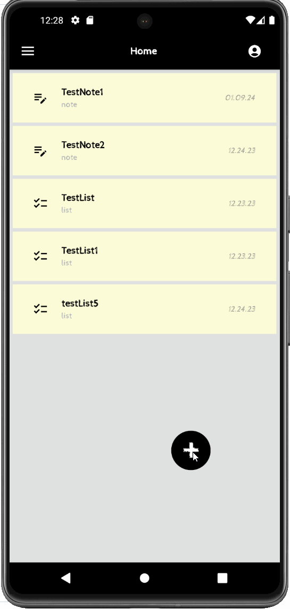

## Features
The following user stories are included:

* A native Android app that allows for quickly creating organized todo lists and notes that are shareable with friends.  
  * [x] Dependency Injection with Dagger/Hilt.
  * [x] MVVM Architecture.
  * [x] Data storage with both Room and Google Cloud Firebase.
  * [x] 7 fragments and 2 activities.
  * [x] Google sign on and authentication. 

## Architecture
This application has a simple architecture. It uses a single activity and several fragments in the front end.
The front end stores local data in view models and then communicates with a backend database via viewmodels 
and repositories to store and retrieve data from two different databases.

## Gif Walkthrough
We have included gifs that show different functionality of the app as it evolved.

The gifs were created with [LiceCap](http://www.cockos.com/licecap/).